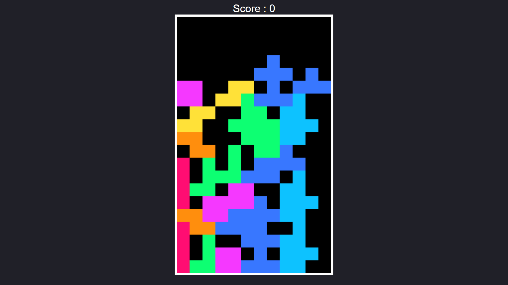

<h1 align="center">Block Gamer</h1>

Block Gamer é um jogo de interação lógica para o usuário jogar.  

 

  

## 🚀 Tecnologias

Esse projeto foi desenvolvido com as seguintes tecnologias:

- HTML e CSS
- JavaScript
- Git e Github

## 💻 Projeto

O Block Gamer é um jogo para treinar a lógica, jogando e se divertir.

- [Visite o projeto online](https://block-game-rho.vercel.app/)
